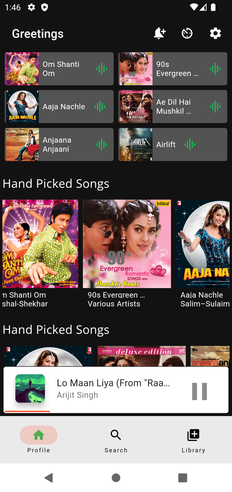
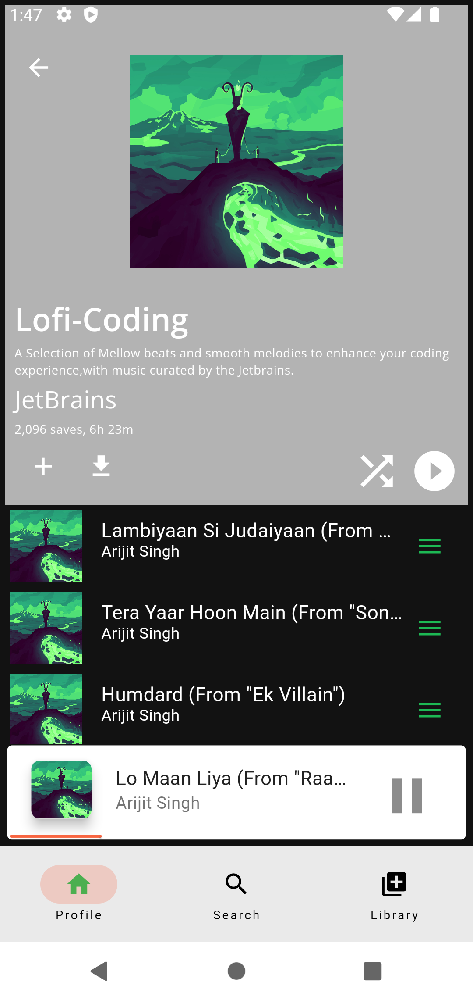
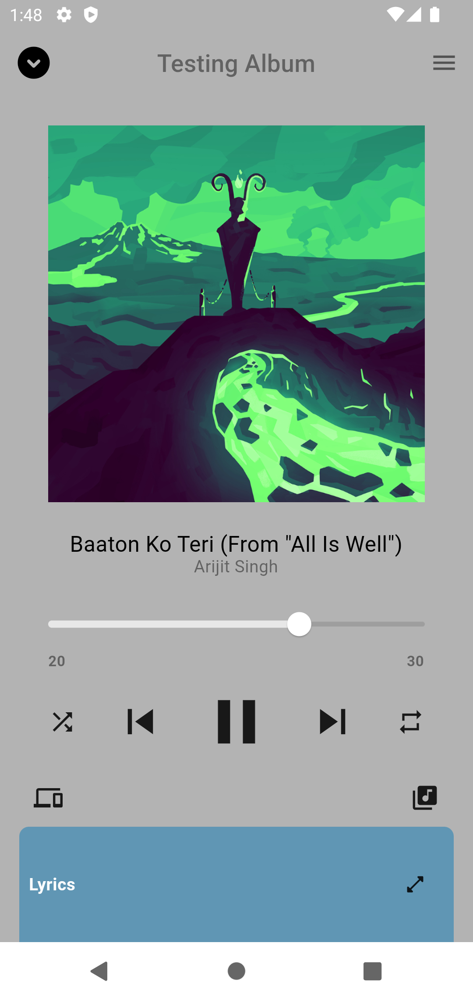
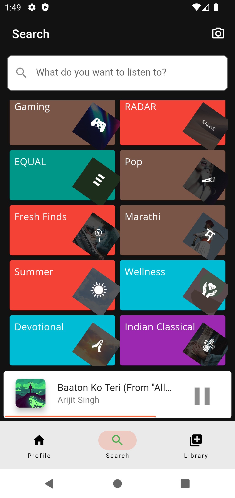
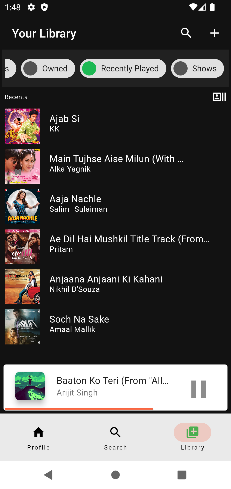
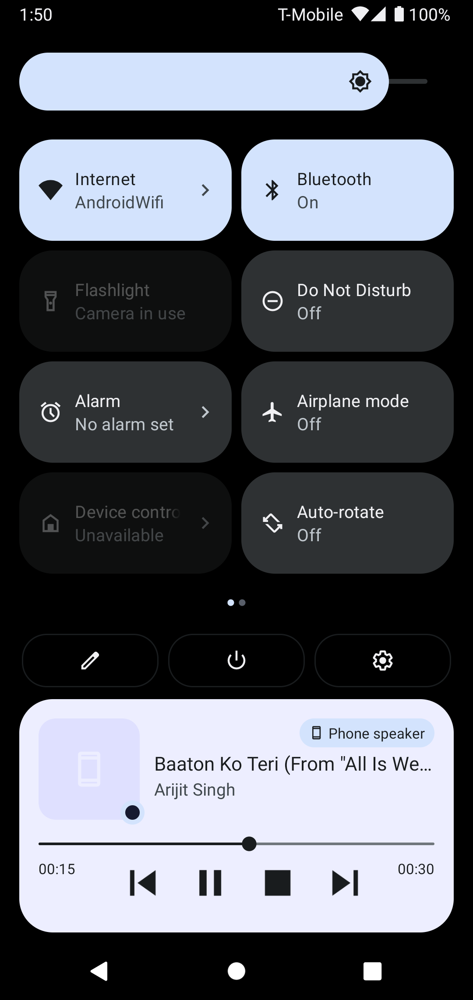
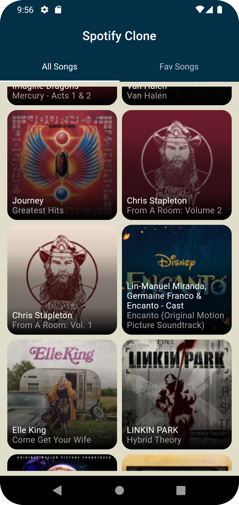
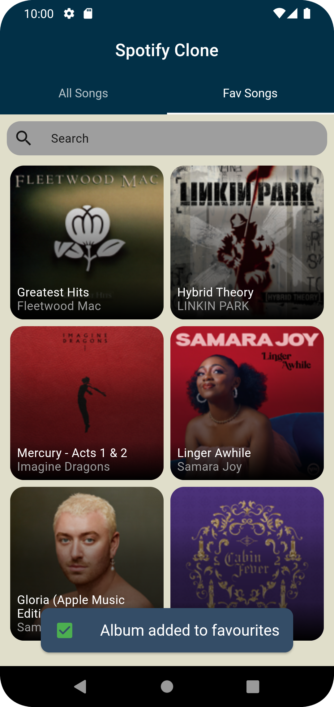
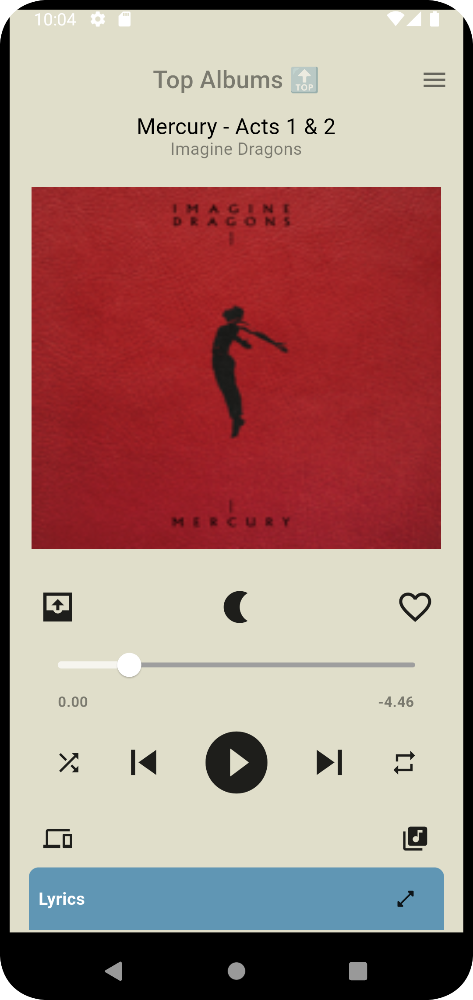

## SpotifyClone - Flutter

  
 A Flutter clean-architecture project that uses BLoC and Dio with best practices. Includes unit tests for each layer. Project is still in WIP 🚧

  

      
      
      
      
      
  

### 👨‍💻 Tech stack

| Tools               | Link                                                            |
|:--------------------|:----------------------------------------------------------------|
| 🤖 State Management | [flutter_bloc](https://pub.dev/packages/flutter_bloc)           |
| 💚 Service Locator  | [get_it](https://pub.dev/packages/get_it)                       |
| 💉 DI               | [injectable](https://pub.dev/packages/injectable)               |
| 🏛 Navigation       | [go_router](https://pub.dev/packages/go_router)                 |
| 🌐 Network Calls    | [dio](https://pub.dev/packages/dio)                |
| 🚀 BloC Test        | [bloc_test](https://pub.dev/packages/bloc_test)                 |
| 🖊️ Mocktail        | [mocktail](https://pub.dev/packages/mocktail)                   |
| 🔊 AudioService     | [AudioService](https://pub.dev/packages/audio_service)                   |
| 🎶 JustAudio        | [JustAudio](https://pub.dev/packages/just_audio)                   |

### ⚒️ Architecture

SpotifyClone Flutter follows the principles of Clean Architecture. The project architecture has been
inspired from [Praxis Flutter](https://github.com/mutualmobile/PraxisFlutter).

# 🖥️ Screens

#### New Look

- App Working Video: 
<video src="art/milestone-one-working-video.mov"></video>

<table style="width:100%">
<tr>
<th>Profile Screen with Mini Player</th>
<th>Song List Screen</th> 
<th>Main Player Screen</th>
</tr>
<tr>
<td></td> 
<td></td>
<td></td>
</tr>
</table> 

<table style="width:100%">
<tr>
<th>Search Screen</th>
<th>Library Screen</th>
<th>Android Notification Player</th>
</tr>
<tr>
<td></td>
<td></td>
<td></td>
</tr>
</table> 

### Old Look

<table style="width:100%">
<tr>
<th>AllSong Screen</th>
<th>Favourite Screen</th> 
<th>SongDetail Screen</th>
</tr>
<tr>
<td></td> 
<td></td>
<td></td>
</tr>
</table>

### New Features :

- Audio Player Integrated
- New Screens integrated
- Shell Route Navigation Routes added
- New Spotify [API]("https://developer.spotify.com/documentation/web-api")
- Animations added (Sliver and Hero)
- Raw Design System added

### 🐥 Upcoming Features :

- Caching Layer for complete app.
- Offline support
- Download Podcast options.
- Support for Web and Desktop with new UI
- Performance Enhancement at UI Layer.
- Dedicated Search screen with filters.
- Integration, Widgets and more Unit tests.
- More Animations.
- Fix Audio Player Bugs and make it smooth across the App. 

